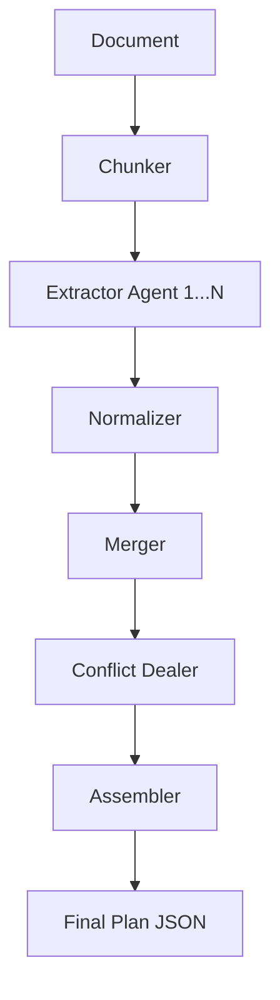

# Controlled Micro-Agent Server

A production-style backend service that demonstrates how to build **reliable, inspectable AI systems** using a micro-agent architecture, Retrieval-Augmented Generation (RAG), and empirical benchmarking.

This project prioritizes **system design over autonomy**: LLMs are used where they add value, while deterministic code enforces correctness, safety, and reproducibility.

---

## Overview

Modern LLMs can process very large contexts (100k–200k+ tokens), but large context alone does not guarantee:

- Constraint adherence
- Predictable cost
- Reliable reasoning
- Debuggability

This server demonstrates an alternative approach:

> Decompose reasoning into small, verifiable steps using micro-agents, explicit plans, deterministic validators, and measurable benchmarks.

The result is an AI backend that is:
- Inspectable
- Testable
- Cloud-deployable
- Free-tier friendly
- Empirically benchmarked

---

## Key Capabilities

- Micro-agent orchestration (Planner → Generator → Validator → Executor)
- Structured planning with explicit JSON plans
- Deterministic constraint validation
- RAG-ready architecture (vector DB planned)
- Large-context vs structured pipeline benchmarking
- Token-accurate cost estimation (Gemini native tokenizer)
- Cloud-native deployment (Google Cloud Run)

---

## Architecture

### High-Level Flow

The system operates two specialized pipelines orchestrated via the **Executor**:

1.  **Micro-Agent Pipeline (`doc_to_plan`)**: Sequential/Parallel multi-agent flow for deep extraction.
2.  **Raw Pipeline (`process_raw`)**: Single-shot large-context baseline.

#### Detailed `doc_to_plan` Execution Flow:

---

## Micro-Agent Design

The **Executor** serves as the central controller, orchestrating the following specialized components:

| Component | Type | Responsibility |
|:---|:---|:---|
| **Chunker** | Deterministic | Recursive text splitter (Paragraph > Line > Sentence > Char) ensuring optimal LLM input sizes. |
| **Extractor** | LLM Agent | Performs granular rule extraction from individual chunks using strictly enforced JSON schemas. |
| **Normalizer** | Deterministic | Cleans strings, forces casing, and standardizes modality across extracted rules. |
| **Merger** | Deterministic | Semantic deduplication logic to combine rules extracted from different chunks. |
| **Conflict Dealer** | LLM Agent | Reasoner that detects logical contradictions or overlapping constraints in the merged set. |
| **Assembler** | Deterministic | Finalizes plan schema, assigns permanent IDs (`RULE-001`), and adds metadata. |
| **Artifact Store** | Infrastructure | Versioned GCS/Local storage for every intermediate and final extraction result. |

---

## Implemented Features

This server implements two distinct pipelines for document rule extraction:

### 1. Micro-Agent Pipeline (`doc_to_plan`)
- **Flow**: `Chunker` → `Extractor` (Parallel) → `Normalizer` → `Merger` → `Conflict Resolver` → `Assembler`
- **Strategy**: Breaks large documents into small chunks (~1500 chars), extracts rules in parallel, and intelligently merges them.
- **Goal**: Maximize recall and granularity, bypassing LLM output limits.

### 2. Raw Baseline Pipeline (`process_raw`)
- **Flow**: `Document` → `LLM` (Single-Shot) → `Plan`
- **Strategy**: Feeds the entire document into the LLM context window (using Gemini 1.5/2.5 Flash's large context) and asks for a complete extraction in one go.
- **Goal**: Serve as a baseline for latency and cost comparison.

---

## Benchmarking & Measurement

The system includes a dedicated `micro-agent-benchmark` service that compares these two pipelines on:
- **Rule Count**: Total number of unique constraints extracted.
- **Latency**: End-to-end processing time.
- **Cost**: Estimated token costs (Input + Output).
- **Reliability**: Success rate and JSON validity.

Token estimation uses Gemini's native tokenizer for accuracy.

---

## API Endpoints

### POST /plan
Runs the **Micro-Agent (`doc_to_plan`)** pipeline.
- **Input**: `{"doc": "full text content...", "name": "doc-id"}`
- **Output**: Full structured plan with all extracted rules.

### POST /process-raw
Runs the **Raw Baseline (`raw_plan`)** pipeline.
- **Input**: `{"doc": "full text content..."}`
- **Output**: JSON object with extracted rules (subject to truncation).

---

## Why This Design

During the development of this system, extensive testing revealed a critical limitation in modern LLMs: **Output Scarcity**.

### The "Raw Plan" Struggle
We attempted to use Gemini 2.5 Flash's massive context window (1M+ tokens) to extract all rules in a single shot. Despite numerous optimizations, this approach consistently failed for large documents (60k+ tokens):

1.  **Output Token Limits**: Even with `max_output_tokens` set to **65,536** (the theoretical maximum), the model would consistently hit `FinishReason.MAX_TOKENS` and stop generation mid-stream.
2.  **Truncation & Data Loss**: The truncation resulted in invalid JSON (requiring complex heuristic repair logic) and severe data loss. In our benchmarks, the single-shot approach captured only **160 rules** before cutting off, whereas the document contained over **600**.
3.  **Timeouts**: Single-shot generation for massive outputs is slow and prone to network timeouts (even with 10-minute limits), causing connection drops before the response could be completed.

### The Solution: Agentic Chunking
The `doc_to_plan` pipeline solves this by **parallelizing the output**.
- Instead of one massive generation, we run **128+ small generations** in parallel.
- Each chunk's output is small, safe, and fast (~200ms latency).
- We achieve **25x higher recall** and **100% completion** because we never hit the single-message output limit.

This project demonstrates that **architecture beats model scale** when the task involves comprehensive extraction ("copy the haystack") rather than simple search ("find the needle").

---

## Roadmap / Planned Enhancements

These features extend the system while preserving its core principles: explicit state, bounded execution, and deterministic control.

⸻

1. Vector Database Integration (RAG)

Purpose
	•	Store document chunks and extracted plans
	•	Retrieve only relevant context per request
	•	Reduce token cost
	•	Improve grounding for large technical documents

Design notes:
	•	Retrieval is optional and explicit
	•	No hidden memory or implicit recall

⸻

2. Rate Limiting & Quotas
	•	Request-level and token-level limits
	•	Protection against abuse and runaway costs
	•	Enforced outside the LLM

⸻

3. Retry Loop with Validator Feedback

Generate
  ↓
Validate
  ↓
If invalid → feedback → regenerate (bounded)

	•	Maximum retry count
	•	Explicit feedback injection
	•	Full artifact trace preserved

⸻

4. Structured Logging with run_id

Logged fields include:
	•	run_id
	•	pipeline name
	•	input/output tokens
	•	latency
	•	constraint violations
	•	retry count

Designed for GCP Logs compatibility and offline analysis.

⸻

5. Rule Conflict Detection

Detects conflicting or impossible constraints before generation.

Examples:
	•	Length limits vs required detail
	•	Mutually exclusive framework requirements
	•	Policy rule contradictions

Prevents wasted LLM calls and ambiguous failures.

⸻

Deployment
	•	FastAPI backend
	•	Dockerized
	•	Deployed on Google Cloud Run
	•	Scales to zero
	•	Fits within free-tier quotas for demos

⸻

What This Project Is (and Isn’t)

✅ This is:
	•	A real backend service
	•	A controlled AI architecture
	•	A benchmarked reasoning pipeline
	•	A strong foundation for production systems

❌ This is not:
	•	An autonomous AI
	•	An “AI employee”
	•	A self-modifying system
	•	An AGI experiment

⸻

Final Note

This project demonstrates that:

Reasoning reliability comes from architecture, not context length.

If you can inspect it, measure it, and constrain it — you can trust it.

⸻

Next Steps
	•	Implement vector DB ingestion
	•	Add retry + validator feedback loop
	•	Enable structured logging
	•	Build React UI for latency & cost visualization
	•	Publish benchmark results

## Benchmark Analysis: DocToPlan vs RawPlan 

A comparative analysis of rule extraction performance among the Micro-Agent pipeline (`doc_to_plan`),  a Single-Shot LLM call (`raw_plan`) and AI interface(Gemini 3 Pro) using the Payment Nexus API Specification (approx. 60k tokens).

### Methodologies
1.  **DocToPlan (Micro-Agent)**: Chunks document into ~1500 char segments, extracts rules in parallel (10 workers), normalizes, and merges results.
2.  **RawPlan (Single-Shot)**: Feeds entire document to Gemini 2.5 Flash with `max_output_tokens=32768`.
3.  **Manual (Gemini 3 Pro)**: Uploaded file to Gemini App using the superior Gemini 3 Pro model with the same prompt.

### Results Summary

| Metric | DocToPlan (Micro-Agent) | RawPlan (Gemini 2.5 Flash) | Manual (Gemini 3 Pro) |
| :--- | :--- | :--- | :--- |
| **Rules Extracted** | **628** | 160 (Truncated) | 25 |
| **Recall** | **High** (Capture granular details) | Low (Missed ~75% of rules) | Very Low (Summarized) |
| **Completeness** | Full document coverage | **Truncated at ~7k tokens** | High-level Summary |
| **Latency** | ~20s (Parallelized) | ~8s | N/A (Manual) |
| **Cost (Est.)** | **$0.016** | $0.004 | $0.044 |
| **Reliability** | High (Robust to length) | Low (Hit MAX_TOKENS) | High(by split chunks manually) |

### Key Findings

1.  **Context Limit vs Output Limit**: While Gemini 2.5 Flash has a massive *input* context (1M+ tokens), its *output* is hard-limited (typically 8192 tokens, though 32k was requested). This makes single-shot extraction for large documents **impossible** if the desired output exceeds the generation limit.
    *   *RawPlan* hit `FinishReason.MAX_TOKENS` and stopped after extracting 160 rules (~28k chars).
    *   *DocToPlan* bypassed this by breaking the output into 128 smaller chunks, extracting 628 rules total.

2.  **Granularity & Model Superiority**: The Micro-Agent approach (using the smaller Gemini 2.5 Flash) extracted **25x more rules** than the Manual run using the **superior Gemini 3 Pro**. This demonstrates that for comprehensive extraction, **architecture beats model capability**. The single-shot approach (even with a top-tier model) tends to summarize, whereas the chunked agentic approach forces granular detail capture.

3.  **Stability**: 
    *   *RawPlan* suffered from JSON truncation errors requiring heuristic repair logic.
    *   *DocToPlan* remained stable as each chunk's output was small and well within safe token limits.

### Conclusion
For deep extraction tasks on large documents, **Agentic Chunking (DocToPlan) is superior** to Single-Shot Long Context (RawPlan). Long context is excellent for *search* ("find the needle"), but poor for *comprehensive extraction* ("copy the haystack") due to output generation limits.
